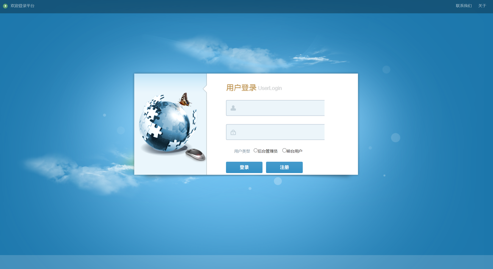
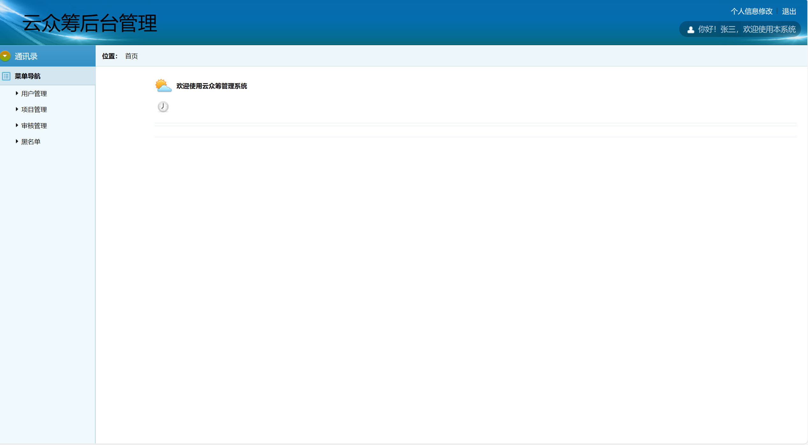
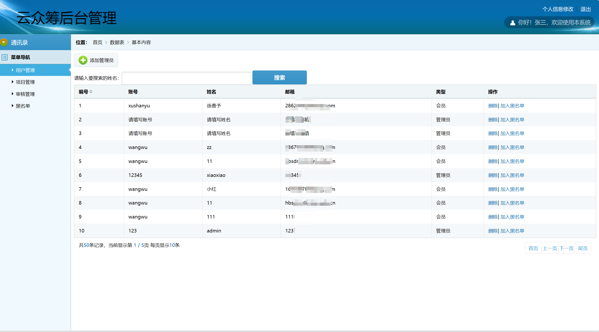
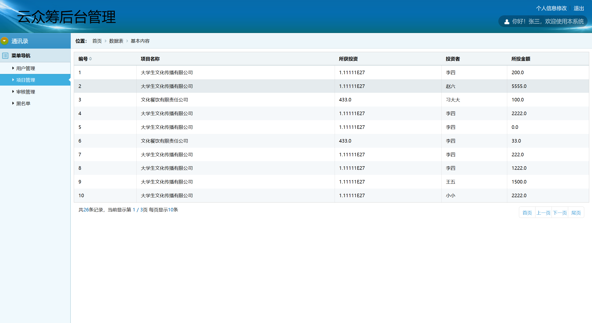
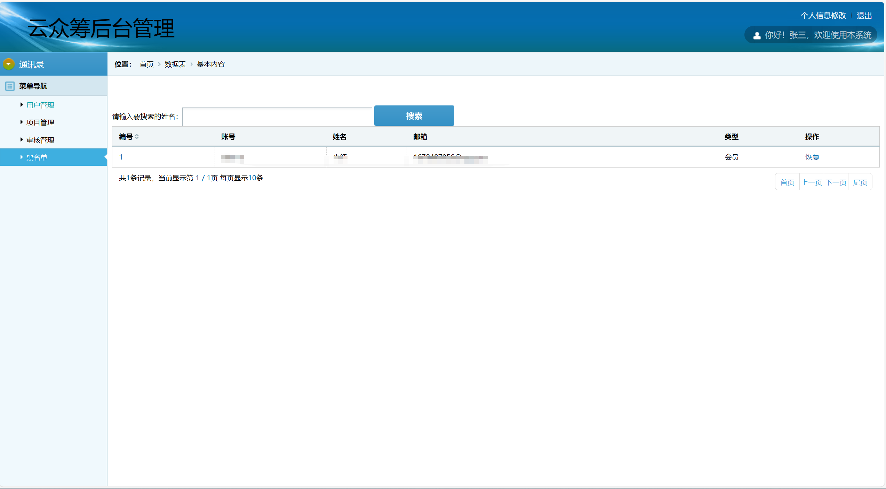
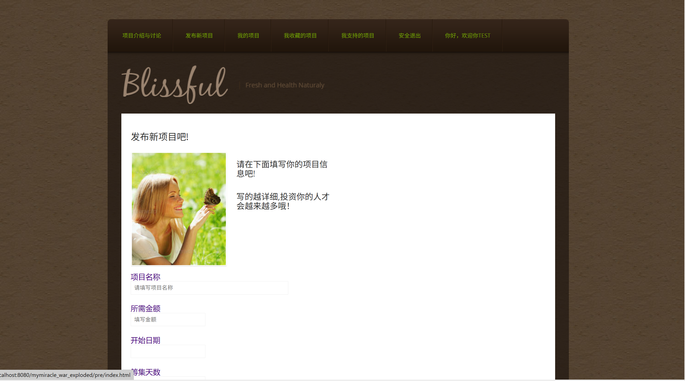
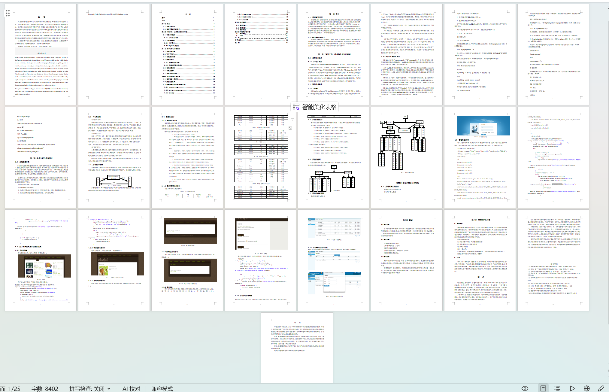

# jspServlet025
jspServlet025爱心公益众筹捐助系统+BG
 
## 源码问题查看主页咨询

### 一、关键词

爱心公益众筹捐助系统，爱心公益系统

### 二、作品包含
源码+数据库+设计报告文档+全套环境和工具资源+本地部署教程

### 三、项目技术
前端技术：Html、Css、Js、Jquery、Bootstrap
后端技术：Java、JSP、Servlet、JDBC

### 四、运行环境（以下版本亲测，其他版本兼容性请自行测试）
开发工具：IDEA/eclipse

数据库：MySQL5.7或8.0

服务器：Tomcat8.5或Tomcat9.0

数据库管理工具：Navicat10以上版本

环境配置软件： JDK1.8

浏览器：谷歌浏览器

### 五、项目介绍
项目编号：jspServlet025

随着物质化办公的日益普及，信息的自动处理以及网络式的信息交互方式越来越被人们认可和应用。让计算机和网络来分享网友的建议与想法,让大家为自己的奇思妙想集资,便出现了新兴名词——公益众筹。众筹的兴起源于美国网站kickstarter，该网站通过搭建网络平台面对公众筹资，让有创造力的人可能获得他们所需要的资金，以便使他们的梦想有可能实现。这种模式的兴起打破了传统的融资模式，每一位普通人都可以通过该种众筹模式获得从事某项创作或活动的资金，使得融资的来源者不再局限于风投等机构，而可以来源于大众。

前台操作界面能完成如下操作：

1.用户注册模块：先注册新用户，注册成功后才能登录。
2.用户登录模块：用户登陆后，才能在本网站上进行操作。
3.用户中心模块：可在个人中心看到用户支持的项目，发起的项目和喜欢的项目。
4.投资模块：支持者可以根据自己的兴趣，对项目进行支持。
5.筹款模块：用户可以查看自己发起的筹款项目。
6.产品模块：可以看到项目的介绍，用户的评论和项目支持情况。

 后台操作界面能完成如下操作：
         1.用户管理：管理员登陆可以查看用户的信息，对其进行管理。
         2.项目管理：管理员可以管理查看项目的筹款情况。
         3.审核管理：管理员可以对用户申请的项目进行评估和确认。

### 六、运行截图

